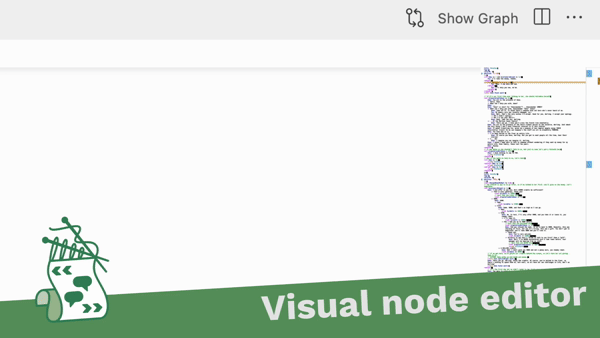
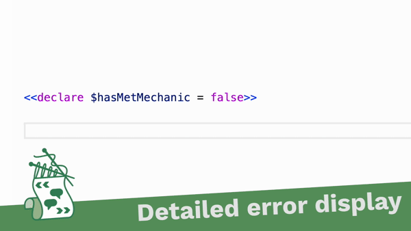
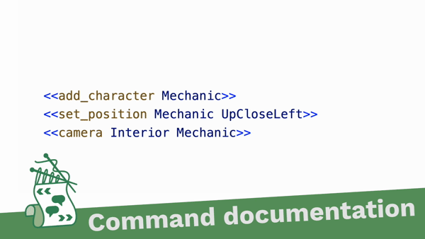
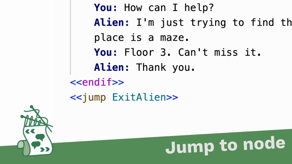

# Yarn Spinner for Visual Studio Code

[Yarn Spinner](https://yarnspinner.dev) helps you build branching narrative and dialogue in games. It's easy for writers to use, and has powerful features for integrating your content straight into your game.

You can install this extension for Visual Studio Code from the [Marketplace](https://marketplace.visualstudio.com/items?itemName=SecretLab.yarn-spinner).

This extension adds language support for Yarn Spinner code, and a visual editor for creating Yarn scripts. 

Yarn Spinner is made possible by your generous patronage. Please consider supporting Yarn Spinner's development by [becoming a patron](https://patreon.com/secretlab)!

## Syntax Highlighting

Your Yarn scripts are colour-coded to help you read the code.

## Visual Editor

Click the 'Show Graph' button when editing a Yarn script, and we'll show you a visual editor that lets you see the position of nodes!

## Error Reporting

Problems in your Yarn script are detected and shown with a red underline. Because your Yarn script is being checked by the full Yarn Spinner compiler, you won't have to switch back to your game engine to see if there are problems anywhere near as often!

## Hover Tooltips for Commands and Variables

Hover your mouse over commands, and you'll see documentation about what it does and how to use it. If you define a command in your Unity game's C# source code, we'll automatically use the documentation comments.

If you hover over a variable, we'll show you information about it - its documentation, its default value, and where it was defined.

## Go To Definition for variables, nodes and commands

Control-click (command-click on macOS) a variable, a node, or a command, and you'll be taken to where it was defined. If you're using Yarn Spinner in a Unity project and you click on a command this way, we'll take you straight to the C# source code for the command!

## And more!

To learn more about Yarn Spinner, or find out how to use and install this extension, head to the [official site](https://yarnspinner.dev) and the [documentation](https://docs.yarnspinner.dev)!

### Defining Custom Commands for Non-Unity Games

Yarn Spinner for Visual Studio Code will automatically find your commands written in C#.

If you want to import command and function definitions for a language other than C#, or you want to override information that the language server parses from C#, add a JSON file with the extension ".ysls.json" to your project's folder using the [ysls.json schema](https://github.com/YarnSpinnerTool/LanguageServer/blob/main/LanguageServer/src/Server/Documentation/ysls.schema.json). 

For examples, take a look at this [import example](https://github.com/YarnSpinnerTool/LanguageServer/blob/main/LanguageServer/ImportExample.ysls.json) or the [yarn spinner built in Commands and Functions file](https://github.com/YarnSpinnerTool/LanguageServer/blob/main/LanguageServer/src/Server/Documentation/BuiltInFunctionsAndCommands.ysls.json). 

### Telemetry

Yarn Spinner for Visual Studio Code collects crash report data to help us detect and fix problems in the extension. To learn more about what we collect, please see our [privacy policy](http://yarnspinner.dev/YS_VSCode_PrivacyPolicy-2022.06.08.pdf).

You can disable this telemetry, along with all other telemetry that Visual Studio Code sends, by opening Settings, and going to Application -> Telemetry, and setting "Telemetry Level" to "none". To learn more, please see [Visual Studio Code's instructions on disabling telemetry](https://code.visualstudio.com/docs/getstarted/telemetry#_disable-telemetry-reporting).
